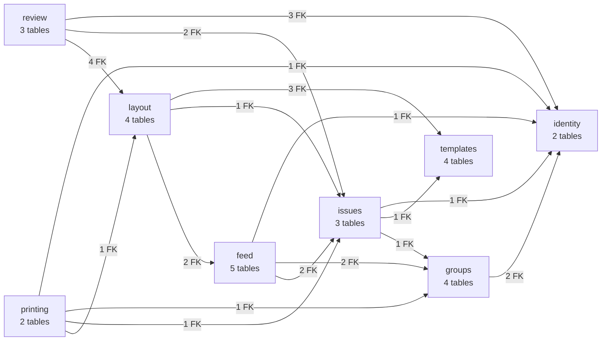
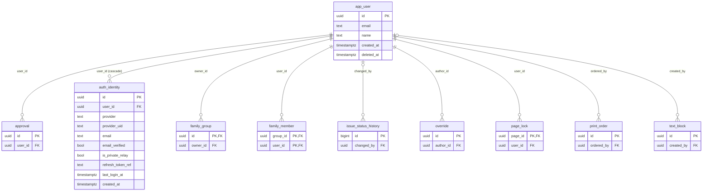
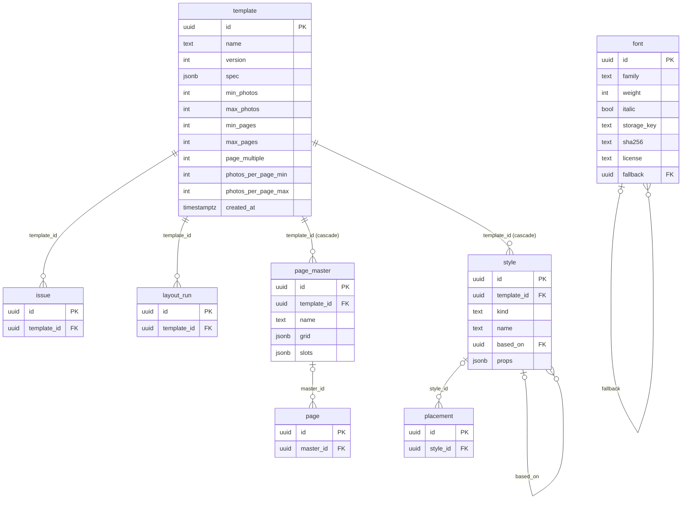
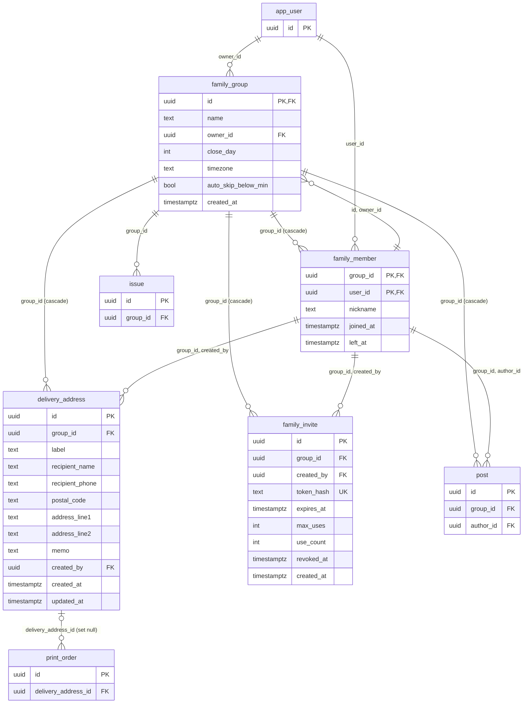
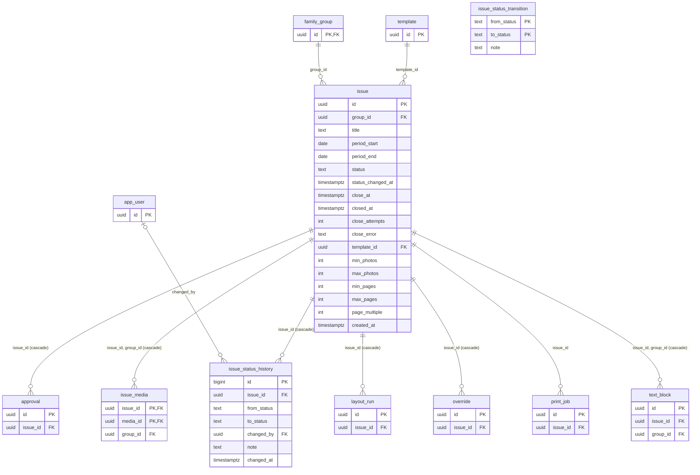
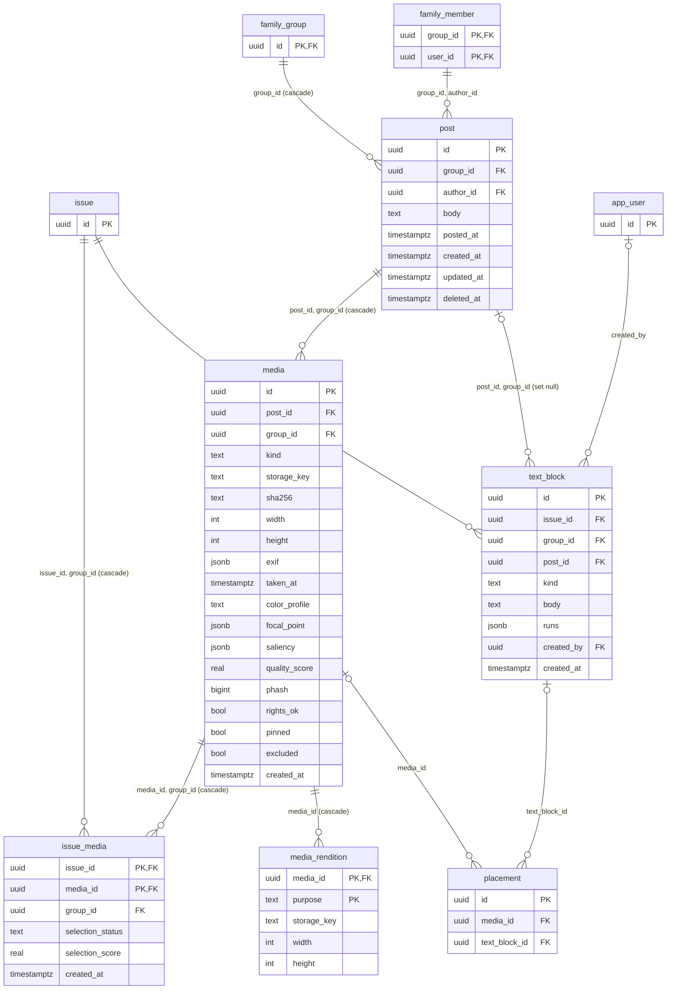
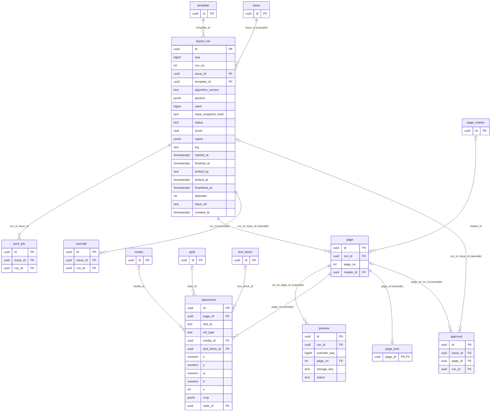
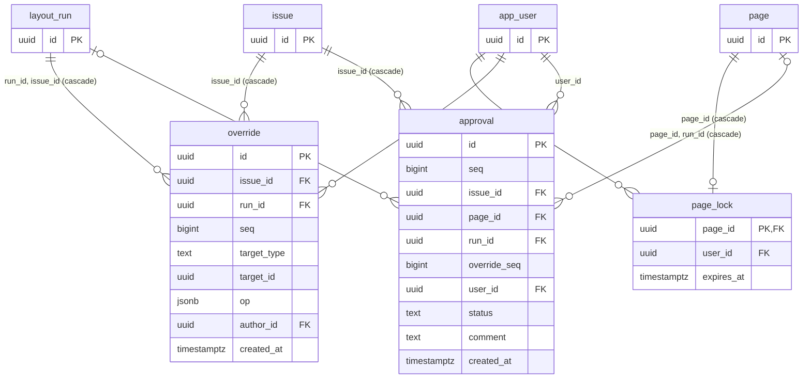
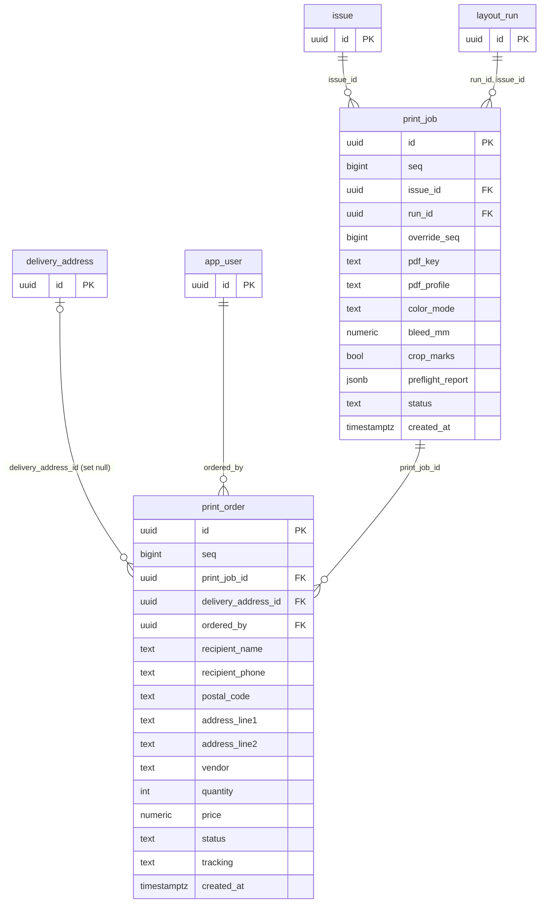

# ERD (자동 생성)

> **이 파일은 DB 스키마에서 자동 생성됩니다. 직접 수정하지 마세요.**
> 갱신: `./scripts/db.sh erd` · CI(`./scripts/db.sh test`)가 스키마와 일치하는지 검사하고, 어긋나면 실패합니다.
> 모듈 경계와 규칙은 [architecture.md](architecture.md) 참고. 소유 모듈은 각 테이블의 코멘트(`module:<모듈>`)가 기준입니다.

범례: `PK` 기본키 · `FK` 외래키 · `UK` 유일 · 관계선 `||--o{` 은 "부모 1 : 자식 0..N", `|o` 는 부모가 선택(NULL 가능), `o|` 는 자식이 최대 1(1:1). 라벨은 외래키 컬럼이며 괄호는 부모 삭제 시 동작입니다.

## 0. 모듈 구성과 의존 방향

화살표는 "참조한다(의존한다)"는 뜻이고 숫자는 모듈 간 외래키 개수입니다.

## 1. 전체 관계 (컬럼 생략)

```mermaid
erDiagram
    "issue" ||--o{ "approval" : "issue_id (cascade)"
    "page" |o--o{ "approval" : "page_id, run_id (cascade)"
    "layout_run" |o--o{ "approval" : "run_id, issue_id (cascade)"
    "app_user" ||--o{ "approval" : "user_id"
    "app_user" ||--o{ "auth_identity" : "user_id (cascade)"
    "family_group" ||--o{ "delivery_address" : "group_id (cascade)"
    "family_member" ||--o{ "delivery_address" : "group_id, created_by"
    "family_member" ||--o{ "family_group" : "id, owner_id"
    "app_user" ||--o{ "family_group" : "owner_id"
    "family_group" ||--o{ "family_invite" : "group_id (cascade)"
    "family_member" ||--o{ "family_invite" : "group_id, created_by"
    "family_group" ||--o{ "family_member" : "group_id (cascade)"
    "app_user" ||--o{ "family_member" : "user_id"
    "font" |o--o{ "font" : "fallback"
    "family_group" ||--o{ "issue" : "group_id"
    "template" ||--o{ "issue" : "template_id"
    "issue" ||--o{ "issue_media" : "issue_id, group_id (cascade)"
    "media" ||--o{ "issue_media" : "media_id, group_id (cascade)"
    "app_user" |o--o{ "issue_status_history" : "changed_by"
    "issue" ||--o{ "issue_status_history" : "issue_id (cascade)"
    "issue" ||--o{ "layout_run" : "issue_id (cascade)"
    "template" ||--o{ "layout_run" : "template_id"
    "post" ||--o{ "media" : "post_id, group_id (cascade)"
    "media" ||--o{ "media_rendition" : "media_id (cascade)"
    "app_user" ||--o{ "override" : "author_id"
    "issue" ||--o{ "override" : "issue_id (cascade)"
    "layout_run" ||--o{ "override" : "run_id, issue_id (cascade)"
    "page_master" |o--o{ "page" : "master_id"
    "layout_run" ||--o{ "page" : "run_id (cascade)"
    "page" ||--o| "page_lock" : "page_id (cascade)"
    "app_user" ||--o{ "page_lock" : "user_id"
    "template" ||--o{ "page_master" : "template_id (cascade)"
    "media" |o--o{ "placement" : "media_id"
    "page" ||--o{ "placement" : "page_id (cascade)"
    "style" |o--o{ "placement" : "style_id"
    "text_block" |o--o{ "placement" : "text_block_id"
    "family_group" ||--o{ "post" : "group_id (cascade)"
    "family_member" ||--o{ "post" : "group_id, author_id"
    "page" ||--o{ "preview" : "run_id, page_no (cascade)"
    "issue" ||--o{ "print_job" : "issue_id"
    "layout_run" ||--o{ "print_job" : "run_id, issue_id"
    "delivery_address" |o--o{ "print_order" : "delivery_address_id (set null)"
    "app_user" ||--o{ "print_order" : "ordered_by"
    "print_job" ||--o{ "print_order" : "print_job_id"
    "style" |o--o{ "style" : "based_on"
    "template" ||--o{ "style" : "template_id (cascade)"
    "app_user" |o--o{ "text_block" : "created_by"
    "issue" ||--o{ "text_block" : "issue_id, group_id (cascade)"
    "post" |o--o{ "text_block" : "post_id, group_id (set null)"
    "issue_status_transition"
```

## 2. 모듈별 상세

해당 모듈의 테이블은 컬럼까지 보여 주고, 다른 모듈의 테이블은 연결에 필요한 컬럼만 보여 줍니다.

### identity

- 참조하는 모듈: 없음 (바닥 모듈)
- 이 모듈을 참조하는 모듈: groups, issues, feed, review, printing

### templates

- 참조하는 모듈: 없음 (바닥 모듈)
- 이 모듈을 참조하는 모듈: issues, layout

### groups

- 참조하는 모듈: identity
- 이 모듈을 참조하는 모듈: issues, feed, printing

### issues

- 참조하는 모듈: identity, templates, groups
- 이 모듈을 참조하는 모듈: feed, layout, review, printing

### feed

- 참조하는 모듈: identity, groups, issues
- 이 모듈을 참조하는 모듈: layout

### layout

- 참조하는 모듈: templates, issues, feed
- 이 모듈을 참조하는 모듈: review, printing

### review

- 참조하는 모듈: identity, issues, layout
- 이 모듈을 참조하는 모듈: 없음

### printing

- 참조하는 모듈: identity, groups, issues, layout
- 이 모듈을 참조하는 모듈: 없음

## 3. 테이블 목록

| 모듈 | 테이블 | 컬럼 수 | 설명 |
|---|---|---|---|
| identity | `app_user` | 5 | 사용자. 탈퇴하면 익명화하고 행은 유지한다 |
| identity | `auth_identity` | 10 | 로그인 수단(카카오/애플). (provider, provider_uid)로 식별 |
| templates | `font` | 8 | 폰트 메타데이터 |
| templates | `page_master` | 5 | 페이지 마스터(슬롯 배치 정의) |
| templates | `style` | 6 | 문단/글자 스타일(상속 구조) |
| templates | `template` | 12 | 불변 버전의 판형 템플릿과 규모 제약(사진/페이지 수) |
| groups | `delivery_address` | 12 | 조부모님 배송지(주소만, 로그인 없음). 주문에는 복사본을 남긴다 |
| groups | `family_group` | 7 | 가족 그룹. 방장(owner_id)과 월 마감 정책(마감일, 타임존, 미달 시 자동 미발행) |
| groups | `family_invite` | 9 | 카카오톡 초대 링크(토큰 해시, 만료, 사용 횟수, 취소). 방장만 만든다 |
| groups | `family_member` | 5 | 그룹 구성원. 나가도 행은 남기고 left_at 만 채운다 |
| issues | `issue` | 18 | 월간 호. 그 달의 게시물을 모아 만든 결과물. 상태는 change_issue_status()로만 바꾼다 |
| issues | `issue_status_history` | 7 | 호 상태 변경 이력 |
| issues | `issue_status_transition` | 3 | 허용된 상태 전이 표 |
| feed | `issue_media` | 6 | 호별 사진 선별 결과(후보/선택/제외와 점수). 마감할 때 만들어진다 |
| feed | `media` | 19 | 게시물의 사진. 이미지 분석 결과와 사용자의 의도(꼭 넣기/빼기) |
| feed | `media_rendition` | 5 | 사진의 파생본(썸네일/미리보기/인쇄용) |
| feed | `post` | 8 | 피드 게시물(글). 호와 독립이고 posted_at 으로 어느 호에 실릴지 정해진다 |
| feed | `text_block` | 9 | 호에 들어가는 글 조각(제목/캡션/인용/본문) |
| layout | `layout_run` | 21 | 자동 조판 실행 1회(seed, 알고리즘 버전, 워커 임대 정보) |
| layout | `page` | 4 | 조판 결과의 페이지 |
| layout | `placement` | 13 | 페이지 위 요소 배치(mm 단위) |
| layout | `preview` | 6 | 페이지 미리보기 렌더 결과 |
| review | `approval` | 10 | 페이지 승인/수정 요청(승인한 조판 버전을 기록) |
| review | `override` | 9 | 사람의 수정 로그(seq 순서) |
| review | `page_lock` | 3 | 페이지 편집 락 |
| printing | `print_job` | 13 | PDF 생성/프리플라이트 작업 |
| printing | `print_order` | 16 | 인쇄 주문 1건 = 배송지 1곳. 받는 사람/주소는 주문 시점의 복사본 |
